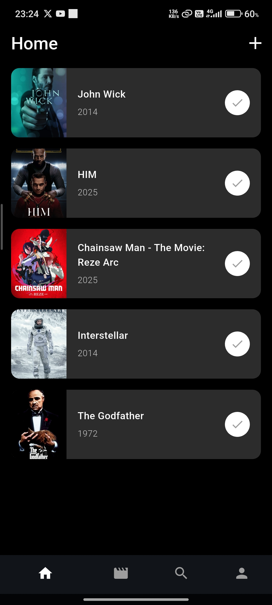
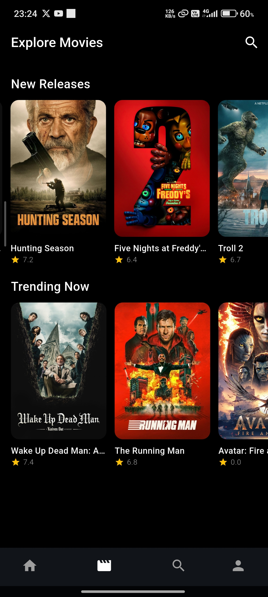
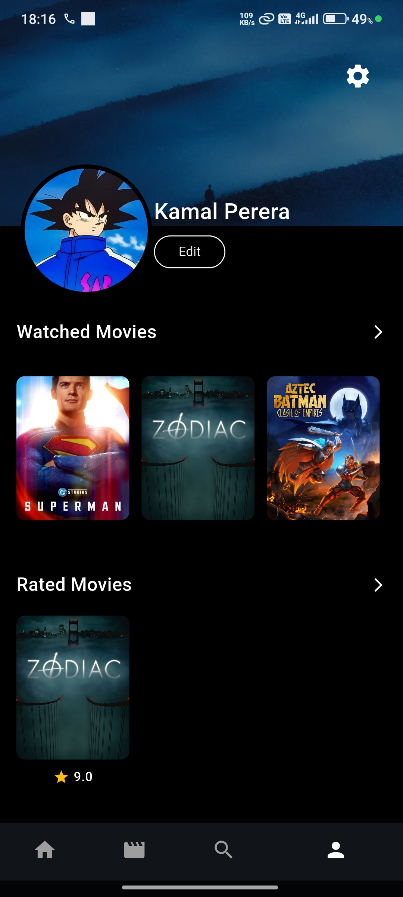

# 🎬 CineList — Movie Wishlist & Discovery App


**CineList** is a cross-platform **Flutter** mobile application designed to help users discover movies, track what they want to watch, and rate films in a fun and intuitive way. The app combines a clean dark-mode UI with real-time cloud sync and offline-first support to deliver a smooth user experience.

---

## 📱 Screenshots

|                          Home                         |                          Explore                         |                          Profile                         |                      Rating                     |
| :---------------------------------------------------: | :------------------------------------------------------: | :------------------------------------------------------: | :---------------------------------------------------: |
|  |  |  |  |


---

## ✨ Key Features

### 🔐 Authentication & Profiles

* Secure **Sign Up / Login** using **Firebase Authentication**
* Persistent sessions with automatic login
* User profile management (name, avatar, banner image)
* Profile images stored efficiently in **Cloud Firestore** (Base64 format)

### 🎥 Movie Discovery

* Browse **Trending** and **New Releases** powered by the **TMDB API**
* Real-time movie search with instant results
* Detailed movie pages including overview and release date

### 🍿 Ratings & Watchlist

* Custom **Popcorn Rater** (0–10 scale) for a playful rating experience
* Personal watchlist to track movies you plan to watch
* Watched movies are automatically removed from the active watchlist

### 💾 Offline-First Experience

* Cloud synchronization using **Firestore**
* Local caching with **Hive** for offline access
* Seamless sync when the connection is restored

---

## 🛠️ Tech Stack

* **Framework:** Flutter (Dart)
* **State Management:** Riverpod 2 (NotifierProvider)
* **Backend Services:** Firebase Authentication, Cloud Firestore
* **Local Storage:** Hive (NoSQL)
* **External API:** The Movie Database (TMDB)
* **Architecture:** Clean Architecture with Feature-First structure

---

## 👥 Team & Contributions

This is a **group project**, and responsibilities were divided as follows:

| Name          | Role / Features                                                               |
| ------------- | ----------------------------------------------------------------------------- |
| Member 1 Santhush | Identity & Accounts: Authentication, Profile Management, Image Sync, Settings |
| Member 2 Sanithu Malhiru | Discovery: Trending UI, Movie Details Screen, Popcorn Rater                   |
| Member 3 Ashen | Core Utility: Watchlist Logic, Search API Integration, CRUD Operations        |

---

## 📂 Project Structure

The project follows a **Clean Architecture + Feature-First** approach:

```text
lib/
├── core
│   ├── constants
│   │   └── tmdb_constants.dart
│   ├── services
│   │   ├── api_service.dart
│   │   ├── connectivity_service.dart
│   │   └── local_storage_service.dart
│   ├── utils
│   │   └── date_utils.dart
│   └── widgets
│       ├── auth_wrapper.dart
│       ├── error_dialog.dart
│       ├── loading_spinner.dart
│       └── popcorn_rater.dart
├── features
│   ├── auth
│   │   ├── data
│   │   │   └── auth_service.dart
│   │   └── presentation
│   │       ├── login_screen.dart
│   │       └── signup_screen.dart
│   └── movies
│       ├── data
│       │   ├── datasources
│       │   │   ├── local_data_source.dart
│       │   │   └── remote_data_source.dart
│       │   ├── models
│       │   │   └── movie_model.dart
│       │   └── repositories
│       │       └── movie_repository.dart
│       ├── domain
│       │   └── entities
│       │       └── movie.dart
│       └── presentation
│           ├── providers
│           │   ├── movie_providers.dart
│           │   ├── profile_provider.dart
│           │   ├── search_provider.dart
│           │   └── wishlist_provider.dart
│           ├── screens
│           │   ├── details_screen.dart
│           │   ├── edit_profile_screen.dart
│           │   ├── home_screen.dart
│           │   ├── main_screen.dart
│           │   ├── movie_screen.dart
│           │   ├── profile_screen.dart
│           │   ├── search_screen.dart
│           │   ├── settings_screen.dart
│           │   └── welcome_screen.dart
│           └── widgets
│               ├── movie_card.dart
│               ├── search_bar.dart
│               └── watchlist_card.dart
├── app.dart
├── firebase_options.dart
└── main.dart
```

---

## 📌 Notes

* This project is intended for learning and portfolio purposes

---

