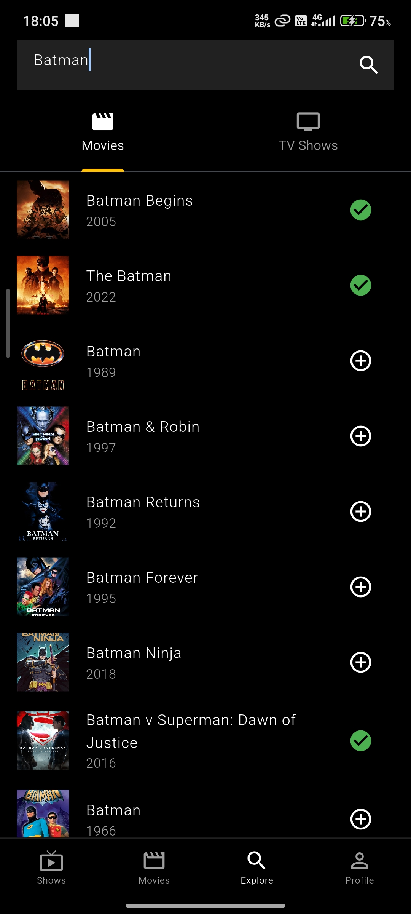
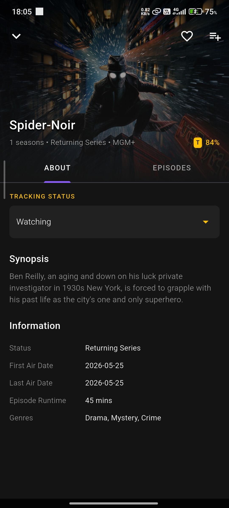

# 🎬 CineList — Movie & TV Show Watchlist & Discovery App


**CineList** is a cross-platform **Flutter** mobile application designed to help users discover, track, and rate movies and TV shows in a fun and intuitive way. Featuring a clean dark-mode UI, real-time cloud synchronization, robust offline-first support, and comprehensive media tracking statistics, CineList serves as a complete media companion.

---

## 📱 Screenshots

|                          Home                         |                          Search                         |                          Profile                         |                      Detailed View                     |
| :---------------------------------------------------: | :------------------------------------------------------: | :------------------------------------------------------: | :---------------------------------------------------: |
|  |  |  |  |

---

## ✨ Key Features

### 🔐 Authentication & Profiles
* Secure **Sign Up / Login** using **Firebase Authentication**.
* Persistent login sessions with automatic authentication wrapper.
* Customizable user profile including display name, avatar, and banner images.
* Cloud upload support: profile images are uploaded directly to **Cloudinary** for fast and efficient hosting.

### 🎥 Discovery & Searching
* Browse **Trending Weekly** and **Now Playing / New Releases** for both movies and TV shows, powered by the **TMDB API**.
* Real-time search functionality with instant results.
* Rich detail pages including overview, rating, release/air dates, and season lists.

### 🍿 Ratings & Watchlists
* Custom **Popcorn Rater** (interactive 0–10 scale) for a playful and visual rating experience.
* Dedicated **Movie Watchlist** to track films you plan to watch or have watched.
* Personal **TV Show Watchlist** with progress tracking ("Watch Next" vs. "Haven't Watched For A While" sections based on update recency).
* Direct show-dropping support via swipe-to-dismiss gesture.

### 📺 Episode-Level TV Tracking & Upcoming Schedule
* Mark individual episodes as watched to track exact viewing progress.
* **Upcoming Episodes Schedule** showing episode release dates, network information, air time, and release countdowns (e.g., days remaining).
* Fast-track viewing by marking aired upcoming episodes as watched directly from the schedule screen.

### 📁 Data Management & Importer
* **TV Time Import:** Import your personal watchlist and viewing history directly from a TV Time CSV export file.
* Smart matching parses titles and links them to TMDB records.
* Automatically records episode watch history to Firestore.
* Interactive **Manual Match Screen** for resolving any unmatched titles.

### ➕ Custom Playlists / Lists
* Create and manage personalized media lists.
* Add or remove movies and TV shows to/from custom lists directly from their detail screen.

### 💾 Offline-First Experience
* Offline caching using **Hive** local NoSQL database.
* Data backup and cloud synchronization utilizing **Cloud Firestore**.
* Offline queue: updates made while offline are synced automatically when the internet connection is restored.

---

## 🛠️ Tech Stack

* **Framework:** Flutter (Dart)
* **State Management:** Riverpod (StreamProvider, NotifierProvider, AsyncValue)
* **Backend Services:** Firebase (Authentication, Cloud Firestore, Cloud Firebase Options)
* **Image Hosting:** Cloudinary API (via Dio)
* **Local Storage:** Hive (NoSQL local storage for offline support)
* **External API:** The Movie Database (TMDB) API
* **Libraries:** Dio (HTTP network requests), flutter_dotenv (environment configuration), CSV (CSV parser), File Picker (file importer)
* **Architecture:** Clean Architecture + Feature-First structure

---

## ⚙️ Configuration & Environment Setup

The application reads configurations from a local `.env` file. Create a `.env` file in the root directory (make sure it is added to your assets in `pubspec.yaml` as `.env` and excluded in `.gitignore`).

### Environment Variables

```env
# Cloudinary Credentials (for profile avatar and banner uploads)
CLOUDINARY_CLOUD_NAME=your_cloudinary_cloud_name
CLOUDINARY_UPLOAD_PRESET=your_cloudinary_preset_name

# Firebase Configurations (Android, iOS, Web, Windows, macOS)
# Replace these with your project's specific Firebase parameters
FIREBASE_PROJECT_ID=your_firebase_project_id
FIREBASE_MESSAGING_SENDER_ID=your_firebase_sender_id
FIREBASE_STORAGE_BUCKET=your_firebase_storage_bucket
FIREBASE_AUTH_DOMAIN=your_firebase_auth_domain
...
```

*Note: The TMDB API Key is built into the `ApiService` class for convenience.*

---

## 📂 Project Structure

The project follows a modular **Clean Architecture + Feature-First** structure:

```text
lib/
├── core/
│   ├── constants/
│   │   └── tmdb_constants.dart
│   ├── services/
│   │   ├── api_service.dart
│   │   ├── cloudinary_service.dart
│   │   ├── connectivity_service.dart
│   │   └── local_storage_service.dart
│   ├── utils/
│   │   ├── date_utils.dart
│   │   └── episode_calculator.dart
│   └── widgets/
│       ├── auth_wrapper.dart
│       ├── error_dialog.dart
│       ├── loading_spinner.dart
│       └── popcorn_rater.dart
├── features/
│   ├── auth/
│   │   ├── data/
│   │   │   └── auth_service.dart
│   │   └── presentation/
│   │       ├── login_screen.dart
│   │       └── signup_screen.dart
│   ├── movies/
│   │   ├── data/
│   │   │   ├── datasources/
│   │   │   │   ├── local_data_source.dart
│   │   │   │   └── remote_data_source.dart
│   │   │   ├── models/
│   │   │   │   └── movie_model.dart
│   │   │   └── repositories/
│   │   │       └── movie_repository.dart
│   │   ├── domain/
│   │   │   └── entities/
│   │   │       └── movie.dart
│   │   └── presentation/
│   │       ├── providers/
│   │       │   ├── custom_lists_provider.dart
│   │       │   ├── movie_providers.dart
│   │       │   ├── profile_provider.dart
│   │       │   ├── search_provider.dart
│   │       │   └── wishlist_provider.dart
│   │       ├── screens/
│   │       │   ├── details_screen.dart
│   │       │   ├── edit_profile_screen.dart
│   │       │   ├── home_screen.dart
│   │       │   ├── import_screen.dart
│   │       │   ├── list_detail_screen.dart
│   │       │   ├── main_screen.dart
│   │       │   ├── media_grid_screen.dart
│   │       │   ├── movie_screen.dart
│   │       │   ├── profile_screen.dart
│   │       │   ├── search_screen.dart
│   │       │   ├── settings_screen.dart
│   │       │   └── welcome_screen.dart
│   │       └── widgets/
│   │           ├── movie_card.dart
│   │           ├── search_bar.dart
│   │           └── watchlist_card.dart
│   └── tv_shows/
│       ├── data/
│       │   ├── datasources/
│       │   │   └── tv_remote_data_source.dart
│       │   ├── models/
│       │   │   └── tv_show_model.dart
│       │   └── repositories/
│       │       └── tv_repository_impl.dart
│       ├── domain/
│       │   ├── entities/
│       │   │   └── tv_show.dart
│       │   └── repositories/
│       │       └── tv_repository.dart
│       └── presentation/
│           ├── providers/
│           │   └── tv_providers.dart
│           ├── screens/
│           │   ├── tv_detail_screen.dart
│           │   └── tv_watchlist_screen.dart
│           └── widgets/
│               ├── episode_card.dart
│               └── tv_time_card.dart
├── app.dart
├── firebase_options.dart
└── main.dart
```

---

## 🚀 Running the App

To run this application locally, ensure you have Flutter installed and configured.

1. **Clone the repository:**
   ```bash
   git clone https://github.com/SanithuM/Movie_watchlist_app.git
   cd Movie_watchlist_app
   ```

2. **Configure Environment:**
   Create a `.env` file in the project root with the variables specified in the [Configuration](#️-configuration--environment-setup) section.

3. **Get Dependencies:**
   ```bash
   flutter pub get
   ```

4. **Run the Application:**
   ```bash
   flutter run
   ```

---

## 📌 Notes & Attribution
* Built for educational and portfolio purposes.
* Media data and images are supplied by [The Movie Database (TMDB)](https://www.themoviedb.org/).
